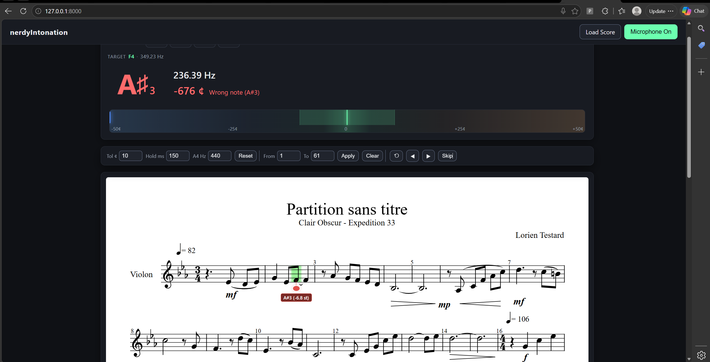

# nerdyIntonation - an open-source Intonation Trainer

An interactive web app that displays music score, listens to your violin through the microphone, and only advances when the current note is played accurately (within a configurable pitch tolerance). 

Also has a built-in chromatic tuner with open-string quick-picks for G / D / A / E.



## Run

The app is a plain static site with no build step. Because browsers block `getUserMedia` and ES module loading on `file://`, serve it over HTTP.

From the project root:

```bash
# Any static server works. Examples:
python3 -m http.server 8000
# or
npx --yes serve .
```

Then open `http://localhost:8000` (or `http://127.0.0.1:8000`) in a Chromium-based, Firefox, or Safari browser.

> Do **not** open the app at `http://0.0.0.0:8000`. Browsers don't treat that as a secure context, so microphone access is silently blocked. The app will show a hint in the status bar if you do.

## Use

### As a tuner

1. Click **Enable Microphone** and grant permission.
2. (Optional) Click one of the four string buttons (`G3 D4 A4 E5`) to lock onto a specific open string.
3. Play. The big letter shows the detected note, the needle shows the deviation, and the panel color tells you sharp / flat / in tune at a glance.

### As a practice trainer

1. Click **Load Score** and pick a file from `test-files/` (try `score-alicia.xml` or `alicia.mxl`).
2. Click **Enable Microphone**.
3. (Optional) Set a practice section: enter start/end measures and click **Apply Section**.
4. Play the highlighted note. When you hold it within the tolerance for the configured time, the cursor advances. At the end of the section, practice restarts from the beginning.
5. To jump to a different spot mid-practice, **long-press** (≈450 ms) anywhere on the score.

### Keyboard shortcuts

- `→` / `←`: Next / Previous note
- `R`: Restart current section
- `M`: Toggle microphone

### Recommended practice progression

| Stage | Tolerance | Hold time |
| --- | --- | --- |
| Beginner (slow practice) | ±20 ¢ | 400 ms |
| Standard (default) | ±10 ¢ | 150 ms |
| Advanced | ±5 ¢ | 100 ms |
| Near performance tempo | ±5 ¢ | 30–60 ms |

## Features

### Score practice
- **Load** `.musicxml` / `.xml` / `.mxl` scores. MXL is a zipped MusicXML container, and OpenSheetMusicDisplay handles it natively.
- **Score display** with a live cursor that highlights the current target note.
- **Section practice**: restrict practice to a measure range; the cursor loops within it.
- **Long-press to jump**: press and hold any point on the score (~450 ms, mouse / touch / pen) to move the cursor to the nearest note.
- **Auto-advance** when the detected pitch sits within the tolerance band for a configurable hold time.

### Tuner
- **Built-in chromatic tuner** with a large letter+octave display, signed cents readout, and a ±50 ¢ needle bar.
- **Open-string quick-pick buttons** (G3 / D4 / A4 / E5): click one to lock the tuner to that string and get *Wrong note* warnings if you bow the wrong one. Auto-disabled while a score is loaded.

### Pitch detection
- **Real-time pitch detection** via the Web Audio API plus the [pitchy](https://github.com/ianprime0509/pitchy) autocorrelation detector.
- **Dropout smoothing**: short dips in signal clarity (bow changes, string crossings) don't blank the display. The last reading persists for up to 500 ms.

### Visual feedback
- **Numeric tuner panel**: detected note (letter + octave), frequency, signed cents, status. The whole panel re-tints green (in tune) / orange (sharp) / blue (flat) / red (wrong note), giving you at-a-glance feedback from across the room.
- **Pitch bar** with a translucent tolerance band and a needle that turns green when in tune.
- **On-score "ghost notehead"** anchored to the OSMD cursor, drifting up/down by the actual semitone deviation so you can see *where* on the staff your pitch is landing relative to the target.

### Customization
- **Tolerance** (±cents), **Hold time** (ms), and **A4 reference** (Hz) are all editable live.
- **Reset defaults** button restores tolerance / hold / A4 in one click.
- Responsive **floating control bar** that pins below the topbar on wide screens (≥1100 px) so settings stay reachable while you scroll through a long score.

## Tech notes

- **OpenSheetMusicDisplay 1.9.x** renders the score (SVG backend) and provides the cursor used both for highlighting and for walking the note stream. Loaded as an ES module from `esm.sh`.
- For each cursor stop with at least one pitched note, the **highest-pitched note** is taken as the practice target (suitable for single-line violin parts; double-stops fall back to the top voice).
- Rests are auto-skipped; they aren't included in the practice step list.
- Pitch detection: `getUserMedia` → `AnalyserNode` (fftSize 2048) → `pitchy.PitchDetector` on float32 time-domain data. Samples below RMS 0.003 / clarity 0.7 are gated out; the rest are smoothed with a 500 ms persistence window so brief dropouts don't flash the display.
- MIDI ↔ frequency uses the configurable A4 reference so you can match a tuner at 440 / 442 / 415 / etc.
- The on-score ghost note is anchored to OSMD's cursor element using a diatonic geometry model where the cursor's vertical span equals the 5-line staff height (so 1 line-spacing = cursorH/4, and 1 semitone ≈ cursorH/8 × 7/12). The full derivation lives in code comments in `src/app.js`.
- No build step, no server, no dependencies installed locally. All file parsing, audio, and rendering run in the browser. Files never leave your device.

## Files

```
intonation/
├── index.html              # UI shell
├── src/
│   ├── app.js              # Wiring: state, events, pitch handler, overlay painter, long-press, tuner
│   ├── score.js            # OSMD wrapper: load, step-list, cursor, section, long-press lookup
│   ├── pitch.js            # PitchTracker + freq↔MIDI↔note helpers
│   └── styles.css          # Dark theme, tuner, pitch bar, floating controls, on-score overlay
├── test-files/             # Sample MusicXML / MXL scores
└── README.md               # This file
```

## Limitations

- Single-voice / monophonic detection: the app picks the top note of each step and listens for one fundamental.
- Detected-note display uses sharps only (no enharmonic spelling); the *target* spelling on the score overlay is preserved from the MusicXML.
- On-staff overlay assumes treble clef (violin); other clefs render the score correctly but the ghost-note anchor will be off.
- No persistence; settings reset on reload.
- No tempo / metronome, since this is an intonation tool rather than a rhythm tool.
- Autocorrelation can occasionally report a pitch one octave low for thin signals; the *Wrong note* warning flags this, but it may briefly flicker before settling.
- Detection latency puts a soft floor around 30–50 ms per note, so hold times below that won't advance reliably.

## Acknowledgments

This app stands on the shoulders of two great open-source libraries, loaded at runtime from [esm.sh](https://esm.sh):

- **[OpenSheetMusicDisplay](https://github.com/opensheetmusicdisplay/opensheetmusicdisplay)** for MusicXML rendering and the practice cursor. Copyright (c) 2019 PhonicScore. Licensed under the [BSD-3-Clause](https://opensource.org/licenses/BSD-3-Clause) license.
- **[pitchy](https://github.com/ianprime0509/pitchy)** for autocorrelation-based pitch detection. Copyright Ian Johnson. Licensed under the [0BSD](https://opensource.org/licenses/0BSD) license.

## License

[MIT](LICENSE) (c) 2026 AqRec
